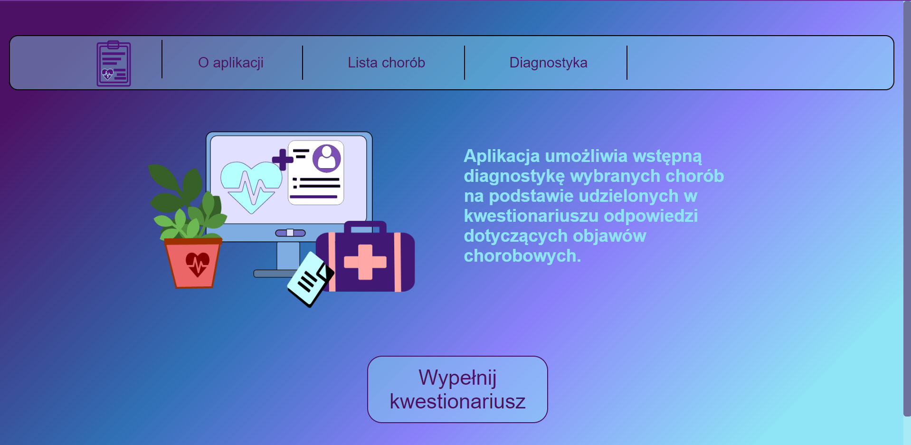

# Diagnostic App
> Web application with expert systems for preliminary diagnosis of specific diseases based on provided by user symptoms.

## Table of Contents
* [General Info](#general-information)
* [Technologies Used](#technologies-used)
* [Features](#features)
* [Screenshots](#screenshots)
* [Setup](#setup)
* [Project Status](#project-status)

## General Information
Created as a basis of a Master's thesis. 
Main purpose of this app is to perform a preliminary diagnosis of a few specific diseases based on provided by user symptoms.  
The task of diagnosing is performed by developed for this app expert systems.  
For the purpose of this app 26 diseases, with over 200 symptoms totally, were chosen. 
Project includes three versions of REST API, each integrated with specific expert system for preliminary diseases diagnosis. 
First expert system is based on algorithm to determine the degree of provided symptoms matching specific diseases. Solution implements weighted bipartite graph.
Second expert system is based on machine learning and implements the multitarget regression for adequate possibility of comparison of its work with the first system.
Third expert system is also based on machine learning, but it implements multiclass classification.
All three systems are meant to deliver an overview on differences in performance and accuracy of possible solutions to the main app objectives.
Application frontend is based on Angular, while backend is based on ASP .NET Core Web API. 

## Technologies Used
- Frontend - Angular (version 15.2.7), Typescript, HTML, SCSS
- Backend and first expert system - .NET 7.0 (C#), Entity Framework, LINQ
- Expert systems based on machine learning - ML.NET
- Database - MS SQL Server Express 2022
- IDE - Visual Studio 2022, Visual Studio Code

## Features
Application main features:
- Functional and easy to navigate app, divided on specific sections
- Section with explanations and instructions regarding app functionalities
- Section with listed all of the diseases and their descriptions available for diagnosing in the app
- Section with user questionnaire for gathering informations about user symptoms + supplementary list of all the symptoms available in the app, which user can also check
- Delivering the result of preliminary diagnosis conducted by expert system on provided by user symptoms - showing all matching diseases with their accuracy percentage

## Screenshots
Main section:

About section:

Diseases list section:

User questionnaire section:

Example result of preliminary diagnosis on provided symptoms:

## Setup
Requirements for setting up local environment:
- Installed NodeJS (version 18.16.0) and Angular (version 15.2.7)
- Visual Studio 2022
- MS SQL Server 2022

## Project Status
Project is: _mostly complete_ 
All main app functionalities have been implemented.
The only thing left in a project are some fixes to some aspects of frontend and some cleaning and code refactoring

Room for improvement:
- Improving the questionnaire section design and responsiveness
- Some fixes to the whole app CSS
- Some cleaning and code refactoring

To do:
- Redesigning way of chosing the other symptoms from supplementary list at the end of user questionnaire
- Improving user questionnaire responsiveness
- Improving display of details in diseases list
- Improvind the display and positioning of items in main nav bar
- Some needed fixes to the whole app CSS
- Some cleaning and code refactoring
